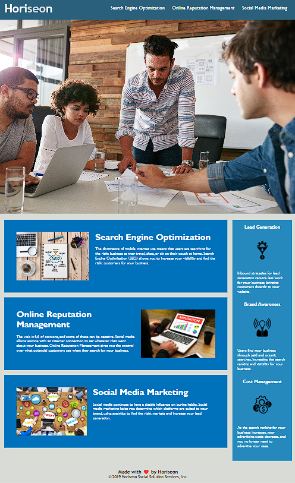

# W1C - HTML, CSS, and Git: Code Refactor

## About the Project
This week's challenge is on-the-job ticket: that the starter code needs to be modified in order to meet the marketing's agency requirements about its accessibility criteria.

## Features
```
- HTML file was modified structuredly with semantic elements
- HTML was given a descriptive title
- HTML image was added 'alt' attributes to meet accessibility criteria
- Some similar CSS selectors was simply combined
- CSS file was given descriptive commentations
```

## Deployment
Please follow [**THIS LINK** https://odthientho.github.io/week-one-challenge ](https://odthientho.github.io/week-one-challenge/) to the deployed application.

## Screenshots

The following image shows the web application's appearance and functionality.

